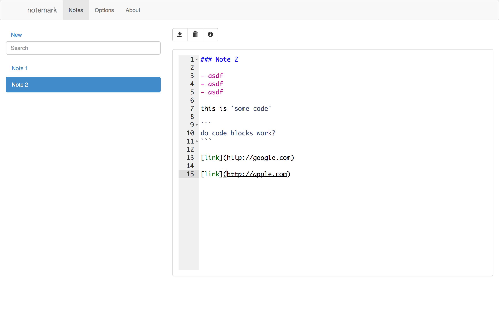
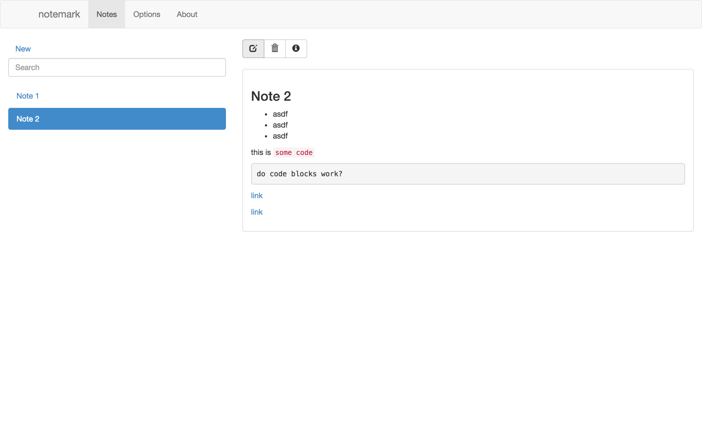

notemark
=========

This was mostly an experimental app to learn [react.js](http://reactjs.com).  The goal for this project is to be a cross-platform desktop app to manage notes where notes are just markdown files on your hard drive (you can point the app to your dropbox folder for syncing across machines).

Here is an initial set of features:

- browse notes using clean, github flavored markdown
- edit notes
- add note
- delete notes
- search for notes based on various metadata including file name and tags
- tell the app where your note directory is (handle sub directories)

The app is built using:

- cloned from [react-bootstrap-starter](https://github.com/jritsema/react-bootstrap-starter)
- [react.js](http://facebook.github.io/react/) (UI library)
- [react-bootstrap](http://react-bootstrap.github.io) (bootstrap components)
- [browserify](http://browserify.org) + [reactify](https://github.com/andreypopp/reactify) + [nodemon](http://nodemon.io) (jsx build pipeline)
- [node-webkit](http://nwjs.io) (now nw.js)

To get started:

- optionally get [react tools for Sublime](https://github.com/reactjs/sublime-react)
- clone repo
- `$ npm install` to install tooling
- `$ npm run build` to build
- `$ npm run watch` to rebuild when jsx files change 

Future things to consider:

- replace npm-based build system with webpack (need to learn more about this)
- replace nw.js (node-webkit) with the [Electron Framework](https://github.com/atom/electron)
- add a more sophisticated messaging design using [flux](https://github.com/facebook/flux) or even [RxJS](https://reactive-extensions.github.io/RxJS/)
- add more features
